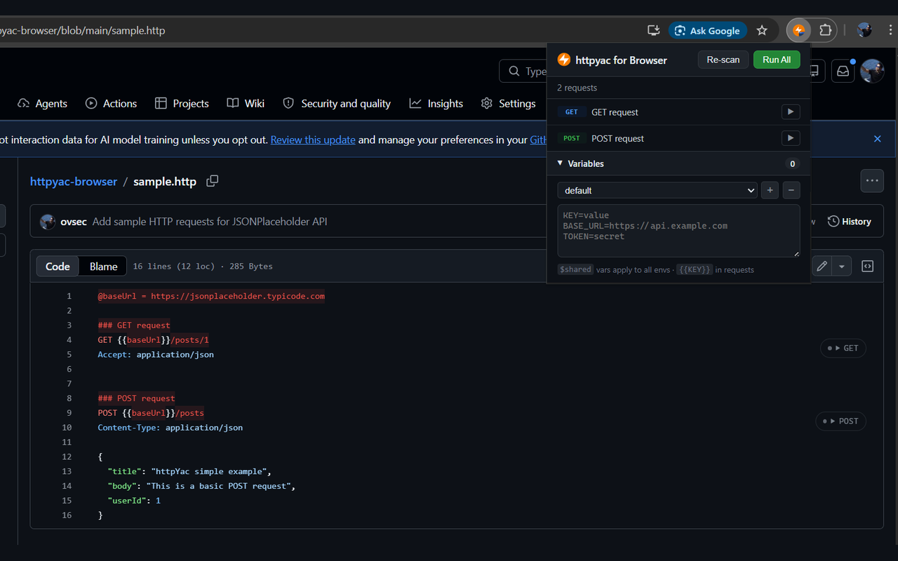
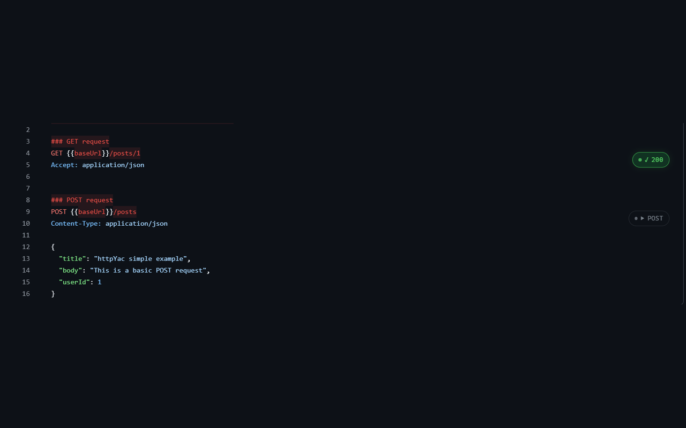
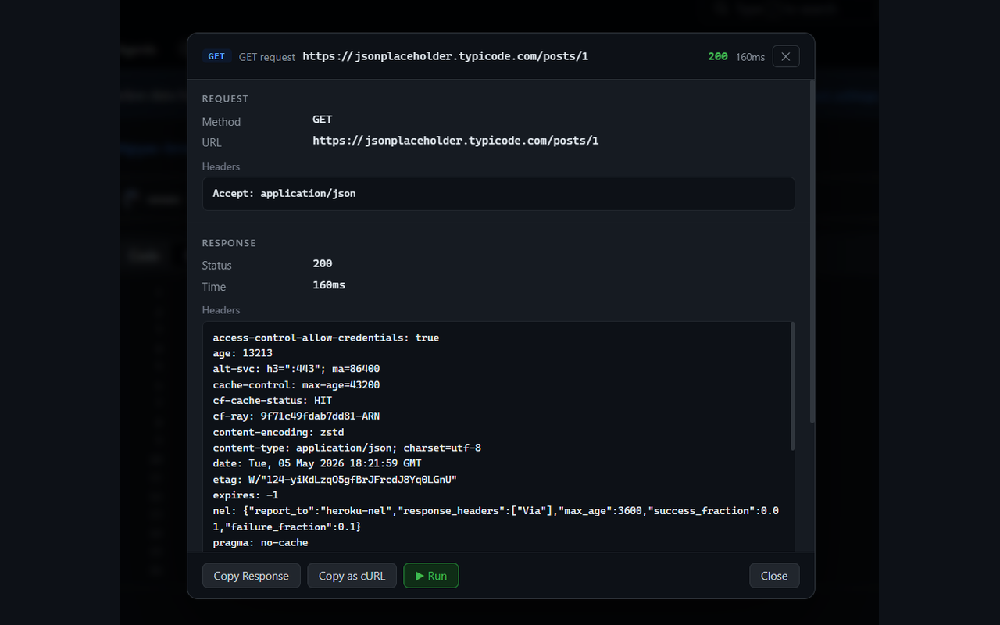
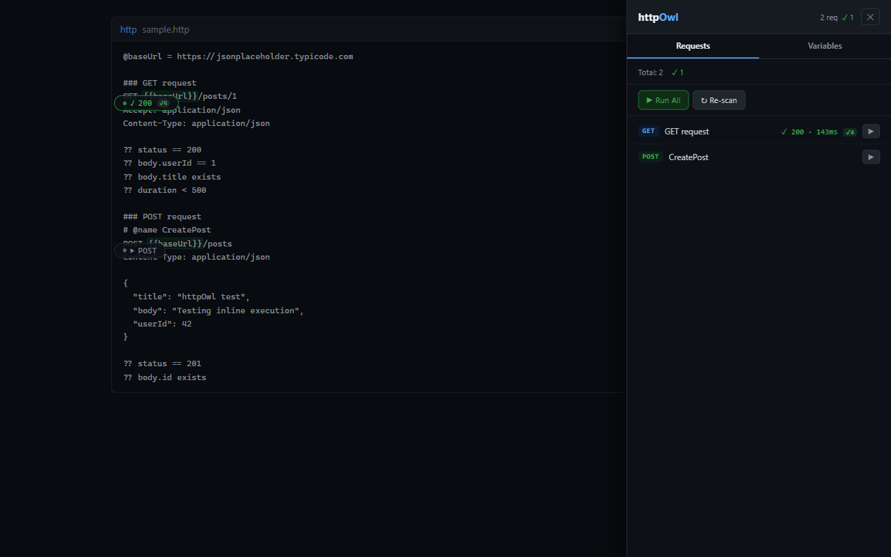

<p align="center">
  
</p>

# httpOwl

A Chrome/Edge extension that detects [httpyac](https://httpyac.github.io/)-style HTTP request definitions on any webpage and lets you run them directly in the browser — no CLI, no VS Code, no switching context. httpOwl is the browser companion to httpYac.

---

## Screenshots

**Inline run pills anchored to each request block**


**Per-request result badges**


**Detail overlay — full request and response**


**Side panel — request list and variables editor**


---

## What it does

When you open a page that contains `.http` file content — a GitHub blob view, a Confluence page, an internal wiki, a raw file — the extension automatically finds all HTTP request blocks and overlays a run button next to each one. Click to fire the request, see the status inline, drill into the full response in a detail panel, and export an HTML report when you're done.

---

## Features

- **Auto-detection** — scans for httpyac-formatted request blocks on page load and on SPA navigation
- **Inline run buttons** — pill buttons appear anchored to the right edge of the code container
- **Per-request results** — status code, response time, pass/fail badge shown inline
- **Detail overlay** — full request (resolved URL, headers, body) and response (headers, body, formatted JSON) with a copy-as-cURL button
- **Assertions** — `??` lines evaluated against the response; pass/fail shown per assertion
- **Environment variables** — `$shared` base layer + named environments (`dev`, `staging`, `prod`, …); active env selected from a dropdown in the popup
- **`{{variable}}` substitution** — applied to URL, headers, and body before sending
- **Run All** — fires every request on the page in sequence
- **HTML report** — self-contained dark-themed report file, downloadable after running requests
- **Works in Chrome and Edge** (Manifest V3)

---

## Supported pages

| Platform | How requests are detected |
|---|---|
| GitHub blob view | Line-by-line reconstruction from code table cells |
| GitHub Raw | Plain `<pre>` element |
| Confluence Cloud | Standalone `<code>` blocks (MutationObserver handles React late-render) |
| Any page | `<pre>`, `<code>`, `<textarea>` elements containing httpyac syntax |

---

## HTTP request format

The extension parses the standard [httpyac REST Client format](https://httpyac.github.io/guide/request.html):

```http
# @name Get business partner
GET {{baseUrl}}/masterdata/sap/v1/businesspartner('{{id}}')?apikey={{apiKey}}
Accept: application/json

###

# @name Create order
POST {{baseUrl}}/orders?apikey={{apiKey}}
Content-Type: application/json
Authorization: Bearer {{token}}

{
  "customerId": "{{customerId}}",
  "amount": 100
}

?? status == 201
?? body.orderId exists
```

**Separators:** `###` splits request blocks  
**Names:** `# @name <label>` sets the display name  
**Variables:** `{{KEY}}` placeholders resolved from the Variables panel  
**Assertions:** `??` lines after the body, evaluated after the response arrives

---

## Assertions

Assertions follow the `?? <expression>` syntax after the request body:

```http
?? status == 200
?? status < 400
?? duration < 2000
?? body.items isArray
?? body.total >= 1
?? header content-type includes application/json
?? body.name startsWith "AB"
```

**Supported operators:** `==` `!=` `<` `>` `<=` `>=` `includes` `contains` `startsWith` `endsWith` `matches`  
**Unary checks:** `exists` `isTrue` `isFalse` `isString` `isNumber` `isBoolean` `isArray`  
**Paths:** dot-notation (`body.items[0].id`), `header <name>`, `status`, `duration`

---

## Variables & environments

Open the **Variables** section at the bottom of the popup.

**`$shared`** — variables that apply to every environment (base layer).  
Named environments (`default`, `dev`, `staging`, `prod`, …) override shared values.

```
# $shared
apiKey=abc123
baseUrl=https://api.example.com

# dev (overrides baseUrl)
baseUrl=https://dev.api.example.com
token=dev-token

# prod
baseUrl=https://api.example.com
token=prod-token
```

Use the `+` button to add an environment, `−` to delete one (cannot delete `$shared`).  
Switch the active environment with the dropdown — the merged variables are applied immediately to all subsequent runs.

---

## How it works

1. `content.js` is injected at `document_idle` and scans for `<pre>`, `<code>`, and `<textarea>` elements
2. Each element's text is parsed into httpyac request blocks (`###`-separated)
3. A Shadow DOM pill container is appended to `document.body` (`position: fixed`) with one pill per request, positioned relative to the source element using `getBoundingClientRect()`
4. Pills reposition on scroll and resize via a RAF-throttled global handler
5. A `MutationObserver` with a 600 ms debounce re-scans on DOM changes (handles React/SPA pages)
6. When a request is run, `content.js` sends an `EXECUTE` message to `background.js`, which makes the actual `fetch()` call (bypassing page-level CORS restrictions)
7. Results and assertion outcomes are stored in an in-memory registry and rendered back into the pills and detail overlay

---

## License

MIT

---

## Privacy Policy

Read our [Privacy Policy](PRIVACY.md). httpOwl does not collect or transmit any personal data.
